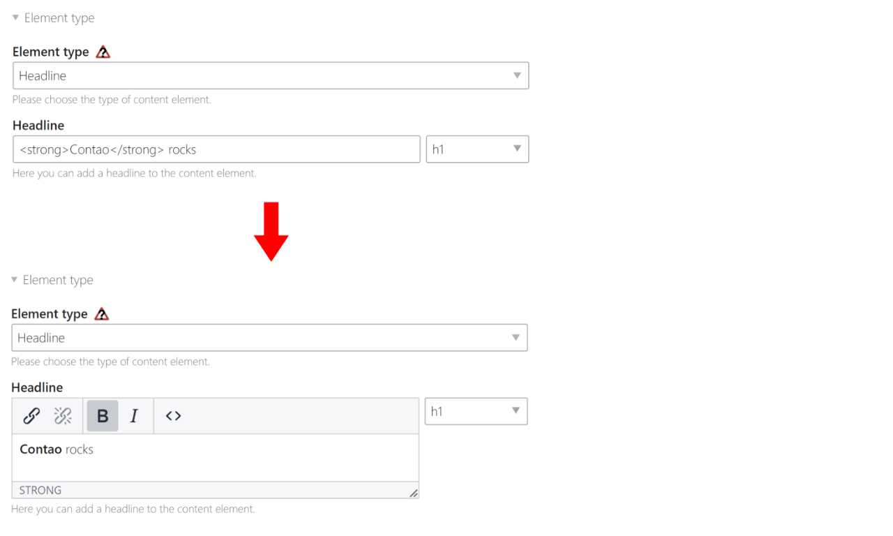

Contao Headline TinyMCE
============
[](https://packagist.org/packages/postyou/headline-tiny-mce)
[](https://packagist.org/packages/postyou/headline-tiny-mce)
[](https://packagist.org/packages/postyou/headline-tiny-mce)

This Contao CMS extension adds a small TinyMCE editor to all DCA `headline` fields and allows HTML tags for them.



## Template
The `be_tinyHeadlineMCE.html5` template is used by default. It restricts the menu and the valid elements. Only [phrasing content](https://www.w3.org/TR/2014/REC-html5-20141028/dom.html#phrasing-content-1) should be allowed inside of HTML headings.

Since TinyMce 6 the option to disable `forced_root_block` is no longer available. The headline is now always saved with a surrounding `<p>` tag. For this reason we use `striptags` to remove all tags that are not allowed in `be_tinyHeadlineMCE.html5`:

```javascript
// be_tinyHeadlineMCE.html5

valid_elements: 'a[href|target|title],strong,em,span[style],br',
```

```twig
{# @Contao/component/_headline.html.twig #}

{{ headline.text|...|striptags('<a><strong><em><span><br>')|raw }}
```
